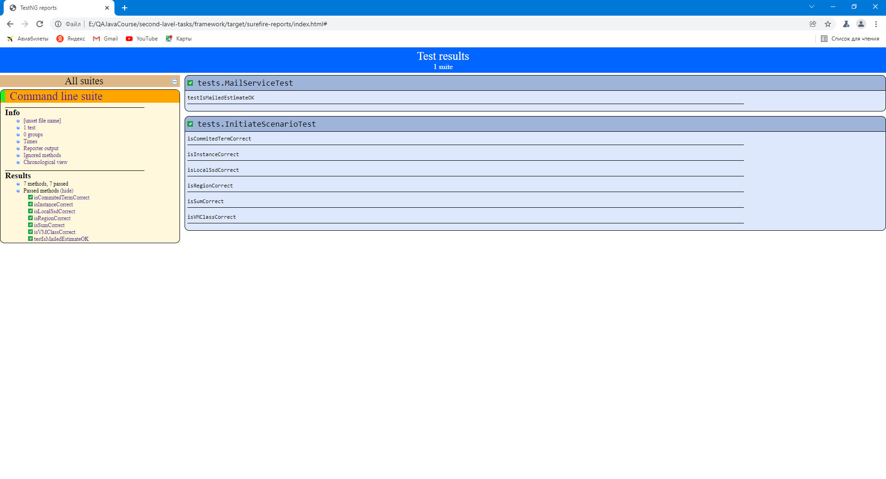

# Внешний тренинг компании EPAM 
# Итоговый фреймворк
  
Задача - построить фреймворк для автоматизации Hardcore задания из курса WebDriver.

Что должно быть в итоговом фреймворке:

1. webdrivermanager для управления коннекторам к браузерам
2. Page Object / Page Factory для абстракций страниц
3. Модель для бизнес-объектов необходимых сущностей
4. properties файлы с тестовыми данным для разных окружений (как минимум 2)
5. xml suites для smoke тестов и всех тестов
6. При падении теста должен быть сделан скриншот с датой и временем
7. Фреймворк должен иметь возможность запуска с Jenkins и параметризацией браузера, тест suite, environment. Результаты тестов должны быть на графике джобы, скриншоты должны быть заархивированны как артефакты   

скрипт для запуска из терминала windows:

mvn -Dbrowser=chrome -Denvironment=dev clean test

для запуска с другим браузером использовать:
mvn -Dbrowser=firefox -Denvironment=dev clean test

Запуск через xml конфигурацию:
mvn -Dbrowser=chrome -Denvironment=dev -Dsurefire.suiteXmlFiles=src\test\resources\testing-smoke.xml clean test

для запуска с другими параметрами (будет падение теста):
mvn -Dbrowser=chrome -Denvironment=qafail

Скриншот в случае падения теста будет сохранен в директории target

Скриншоты работы фреймворка:
* passed tests:
    
   

   
* failed tests: 

